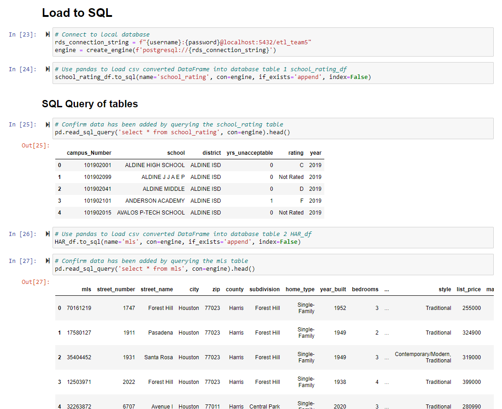
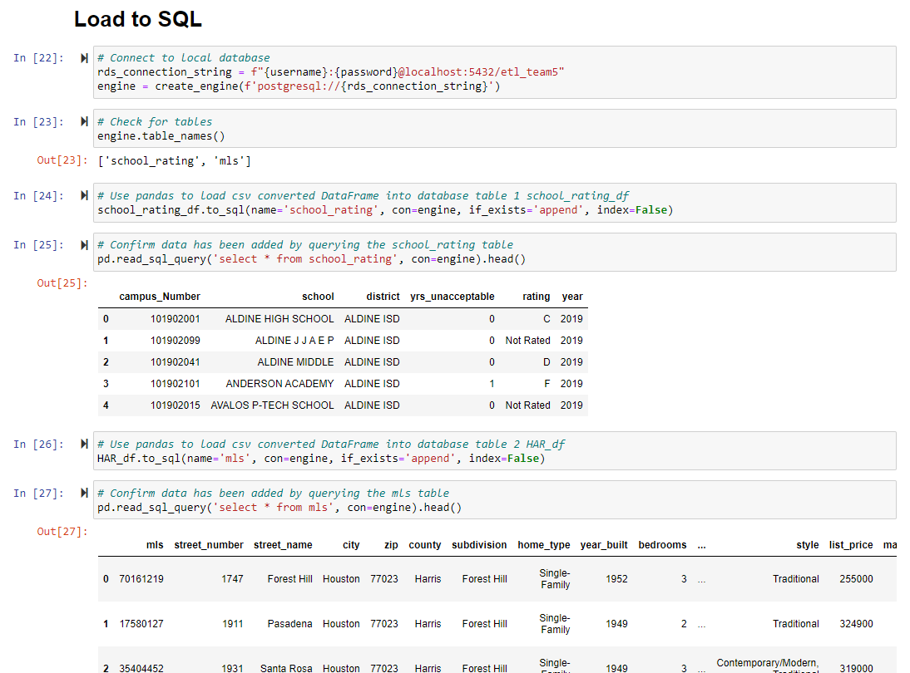

<h1>Extract, Transform, and Load</h1>
<h2>Objective(s)</h2>
 
Purchasing a home is typically one of the most important decisions a family undertakes.  In 2020 $18.4 billion in property was sold in Harris County with another $58.2 million in leases.  For many home buyers the quality of the schools is a critical aspect for home selection. 
 
<h2> Database Replication Instructions</h2>
The first step into replicating this project is to analyze and create an <a href="https://github.com/plqualls/ETL_Project/blob/main/ERDv11.sql">ERDv11.</a>

* As an alternative process a notebook was created in which transformation was primarily with Python. The endpoint is identical to the original v11 notebook [Alt_Master_v11](https://github.com/Krla20/ETL_Project/blob/main/Alt_Master_v11.ipynb).
* Also, to run the jupyter notebook a secrets.py file with your username= "postgres" and password= "password_here" should be added.
 
To reproduce the pipeline, run the Jupyter Notebook that is included in the repository called <a href="https://github.com/plqualls/ETL_Project/blob/main/Master_file_v11.ipynb">Master_file_v11.</a>    
 
<h2>1. Extract data from HAR.com and TEA.texas.gov.</h2> 
   HAR.com (https://www.har.com/) provides data from the Houston Association of Realtors. The dataset includes homes for sale in the Houston metro area.  HAR.com provides filters for their data.  Homes were filtered using "Active" listing and "HISD (Houston Independent School District)" criteria.  Data was downloaded 06 Feb 2021 utilizing Texas real estate license #725751. 
 
   

 
 
   TEA.texas.gov (https://tea.texas.gov/) provides data from the Texas Education Agency. Texas provides annual academic accountability ratings to its public school districts, charters and schools. The ratings are based on performance on state standardized tests; graduation rates; and college, career, and military readiness outcomes. The ratings examine student achievement, school progress, and whether districts and campuses are closing achievement gaps among various student groups. Data was filtered to include only HISD (Houston Independent School District) schools.[TEA.texas.gov]  Data was downloaded 06 Feb 2021 from the public site. 
    
   

 
<h2>2. Transform</h2>
   HAR.com - Some columns deemed unimportant to the home buyer, e.g., columns related to listing agent and office, were dropped from the dataset.  Columns formatted as currency data types were converted to float data type. 
 
   TEA.texas.gov - The pandemic in 2020 prevented school ratings from being calculated.  This column, and ratings prior to 2019, were dropped from the dataset.  Schools are assigned a grade for their academic performance with "A" being the highest score and an "F" as the lowest. 
 
Each dataset's .csv file was imported into a Jupyter Notebook python file. There the data was transformed into pandas dataframes for examination. 
 
The HAR data is an entity of homes for sale.  The raw dataset has twenty-eight columns with the MLS(Multiple Listing Service) number as an unique ID. In examining the data each field is independent from the others. As example, the number of garages does not depend on the number of bedrooms or the home type. The subdivision is not dependent on the street name or number of fireplaces. No independent entities could be identified in the table.  Each field is a characteristic of the home represented by the MLS number. When examining school data it is observed that a high school can serve multiple market areas and can be paired with different elementary schools. Every home is in Harris County but the team kept that field in the event MLS dataset from other counties were included into the dataset as additional tables.  School District was considered for deletion but was kept in the event that, in the future, other MLS listings are added to dataset. It is possible that in the state of Texas there are schools with the same name but in different districts. 
 
The TEA data is an entity of schools. The campus number is the table's unique ID. Examination reveals no independent entities within the table. The ratings are typically scored by year but the raw data included a note that 2020 could not be scored due to the pandemic. The 2019 year data was selected.  The raw data labels each column with year and rating.  These two characteristics were split into separate columns. 
 
As part of the normalization process a junction table is created utlizing the primary keys "mls" and "campus_number" from the clean datasets. Only the MLS number and the two school columns are retained. Then the MLS records are copied and pasted it below the existing data in Excel. In the first set of records the elementary school is deleted and in the second set the high school is deleted. Using VLOOKUP the campus number is retrieved from the TEA data for the schools that are now in a single column. 
 
After cleaning, the data is saved to a clean csv. 
 
Cleaning activities included: 
   - Column names were altered or shortened in some cases.  Spaces between words were replaced with underscores.  
   - Null values were managed by either replacing with zero or accepting the null values, e.g. number of fireplaces and garages. 
   - Null values in year built are rare. In a real world application the HCAD.org dataset could be used to replace the null values in the HAR dataset for the year built. The HCAD.org dataset is 200 mb and impractical for this project so the decision was made to replace the null values by a random number generator ("=RANDBETWEEN()". 
   - Cleaned data is saved as a new .csv file and saved to the Resources folder. 
 
<h2>3. Load</h2> 
   The ETL Pipeline is drawn using smart art and Microsoft Word.  References were made to online examples.
    
   

 
 
   The ERD is created using free a QuickDBD template. This file was saved in .sql and as .png format.   
    
   

 
 
   From Juypter Notebook, we created a connection to load the tables into Postgres for table creation and population.  
    
   

 
    
   View in PGAdmin4: 
    
   

 

 

   

   

